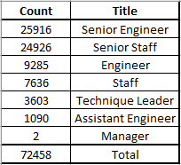
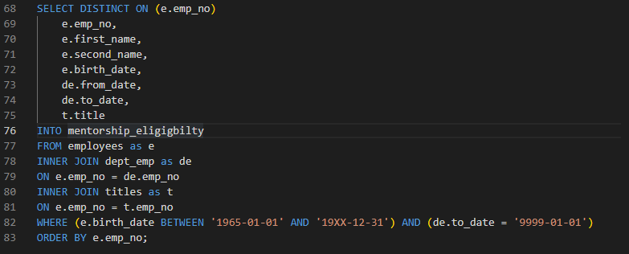

# Pewlett Hackard: The Sliver Tsunami
## Overview of the Analysis
#### This analysis is to address the upcoming surge of retirements and give management a chance at strategizing for leadership gaps that will result.

#### Company records were filtered for people born between 1952 and 1955 and still currently employed with the firm.  These employees are assumed to be leaving the company to pursue their golden years.  Data Analyst have created another list of employees that are 10-to-13-year junior to the current potential retirees.  The intent is to identify the next generation of management and to provide mentorship for these employees to assume the roles.  A list of potential retirees, their successionist, and which departments are most effected have all been developed and are ready for discussion.

## Results
#### First, we will address what has been found regarding our potential retiree candidate pool.  
-	The company stands to lose up to 72,458 headcounts.
-	The largest number, 25,916, are Senior Engineers.
-	The second largest, 24,926, are Senior Staff. 

### Retirees by Department

#### Secondly, a potential pool of next generation leaders has been identified.
-	The identified pool of candidates is 1,550 from the year born 1965.
-	217 are Senior Engineers.
-	508 are Senior Staff.

## Summary
#### As it can be seen there is a large discrepancy (72,458 - 1,550 = 70,908) in the number of potential retirees and current employees to backfill these roles.  Our original candidate investigation contains itself only to the year 1965.  It’s suggested that we expanded this search to a year that matches the number of people leaving.

### Expanded Search
#### See last line and substitute for year.

